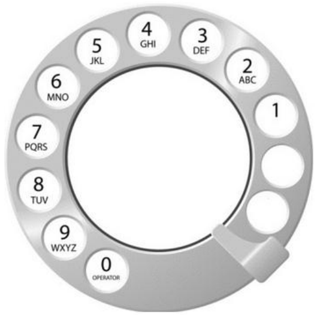

[BAKA](https://www.acmicpc.net/problem/5622)

| # | Memory | Time |
| - | ----- | -------- |
| 1 |31256 KB|44 ms
| 2 |31256 KB|44 ms

---

## Task
Mirko's grandma still uses an ancient pulse dial telephone with a rotary dial as shown in the following picture:

For each digit that we want to dial, we need to turn the rotary dial clockwise until the chosen digit reaches the finger stop (metal fin). Then we let go of the dial and wait for it to return to its original position before we can dial another digit. In our modern, instant gratification world, the dial return often lasts much longer than our patience. More precisely, dialling the digit 1 takes a total of two seconds, while dialling any larger digit takes an additional second for each additional finger circle counting from 1 to the dialled digit (as shown in the picture).

Mirko's grandma remembers phone numbers by memorizing a corresponding word which, when dialled, results in the correct number being dialled. When dialling a word, for each letter, we dial the digit which has that letter written next to it on the dial (for example, the digit 7 for the letter S). For example, the word UNUCIC corresponds to the number 868242. Your task is determining, for a given word, the total time required to dial that word.

---

## Input Format
The first and only line of input contains a single word consisting of between 2 and 15 (inclusive) uppercase English letters.

---

## Output Format
The first and only line of output must contain the required dialling time.

---

## Sample Input 0
<pre>UNUCIC</pre>

---

## Sample Output 0
<pre>36</pre>